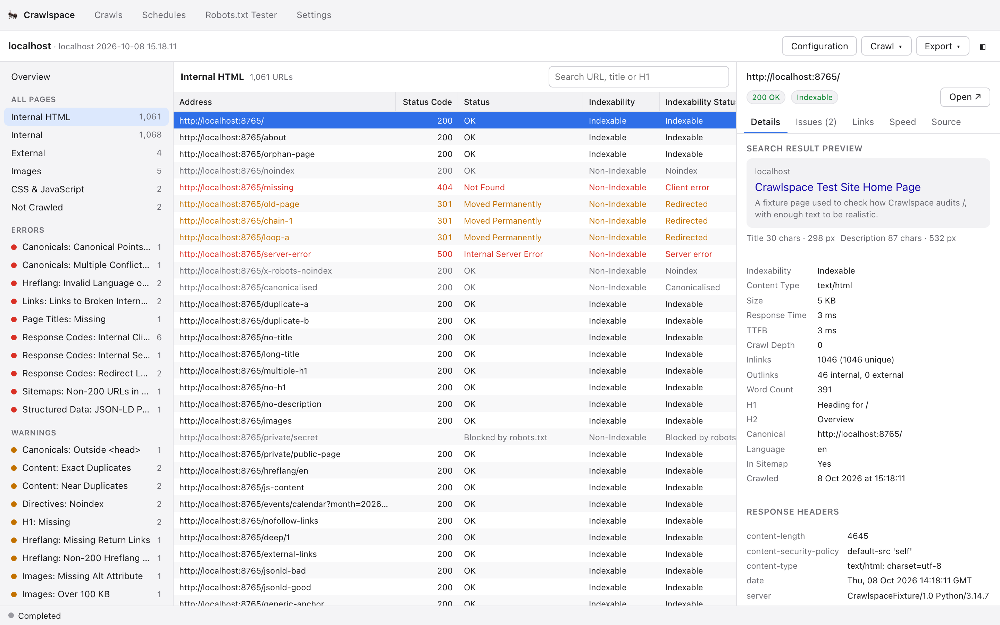
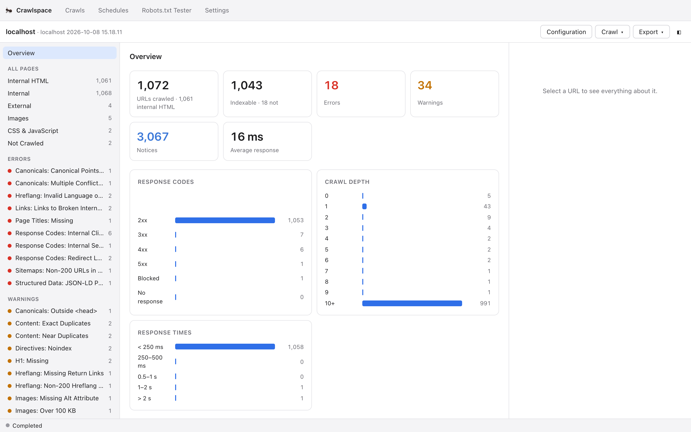

# Crawlspace

An SEO crawler for the Mac: point it at a site, it crawls the pages, and reports the problems
search engines care about — broken links, redirect chains, duplicate titles, missing canonicals,
hreflang mistakes, slow pages and so on.

It runs in the menu bar and you use it in your browser. Every push to `main` becomes a
release, and every installed copy updates itself — no DMGs to hand round, and no signing.

Built for macOS 26. Swift 6 for the crawler and a small local server, React for the interface,
SQLite storage, Lighthouse for speed.



<details>
<summary>The overview of a crawl</summary>



</details>

Both screenshots are of a crawl of a deliberately broken test site.

## Installing it

Run this in Terminal:

```bash
curl -fsSL https://raw.githubusercontent.com/drkge/crawlspace/main/Tools/Release/install.sh | bash
```

That installs `Crawlspace.app` into `~/Applications`, sets up Lighthouse, adds a
`crawlspace` command for Terminal, and opens it. No GitHub account is needed: installing and
updating read this public repository's releases.

**Why nothing has to be approved in System Settings.** macOS only checks apps that carry the
quarantine flag, and only browsers, Mail and AirDrop add it. The installer and the app's own
updater download with curl and URLSession, which don't, so the ad-hoc signature every Swift binary
gets is all it needs. Don't email or AirDrop the app to someone — that copy *would* be
quarantined. Send them the line above.

## Using it

The ant in the menu bar opens Crawlspace in your browser (so does opening the app again, or
double-clicking a `.crawlspace` crawl in Finder). The page lives at `http://127.0.0.1:7777`; only
this Mac's browser can use it — the server listens on the loopback address only, checks the Host
header, needs a token the menu-bar link sets as a cookie, and refuses changes from other sites.

Crawls carry on when the tab is closed. Quitting from the menu bar asks first if one is running, and
a stopped crawl can be resumed later. The Mac doesn't idle-sleep while a crawl or Lighthouse run is
going.

## Updates

Each copy checks GitHub for a new release when it starts and every half hour, downloads it, checks
it against the SHA-256 GitHub publishes, and installs it **once no crawl or Lighthouse run is
going** — or straight away from the banner in the page or the menu bar. The new copy takes over the
same address, so open tabs reconnect by themselves. If it doesn't answer within half a minute, the
previous version is put back.

Releases come from `.github/workflows/release.yml`: on every push to `main` it builds the app and
the Lighthouse runtime and publishes them as release `v2.1.<run number>`. Changes to the README or
`docs/` alone don't make a release.

## Speed reports (Lighthouse)

When a crawl finishes, Crawlspace measures its most-linked indexable pages with Lighthouse, on
**mobile and desktop** — 25 by default, set in Configuration ▸ Speed reports, 0 to turn it off. Any
page can be measured from the inspector's Speed tab, any selection from the table's right-click
menu, and the top pages again from Crawl ▸ Run Lighthouse.

- Mobile and desktop scores join the Internal HTML table as columns, and LCP, CLS and TBT are
  available as columns too.
- Slow pages become issues in a **Speed** category: score under 50, LCP over 4 s, CLS over 0.25
  (errors on either device are warnings), TBT over 600 ms and scores of 50–89 (notices). They go
  into ClickUp and the audit report like any other issue.
- The inspector shows each device's metrics, Lighthouse's top suggestions ("Render-blocking
  requests −300 ms"), and opens the full Lighthouse report.

Pages are measured one at a time, about 15 seconds a run, because Lighthouse runs side by side slow
each other down and both report worse scores than the page deserves. It runs on a copy of Node that
comes with Crawlspace (`Tools/Lighthouse` pins Node and Lighthouse; changing either ships a new
runtime with the next release) and the Mac's own Chrome, Edge, Brave or Chromium — or, if there's
none, a headless Chrome for Testing it downloads. Signed-in sites work: Lighthouse sends the crawl's
cookie, headers and basic-auth password.

There's no Google integration — no Search Console, GA4, URL Inspection or PageSpeed API — so
there's no Google account to connect.

## What it checks

92 checks across 17 categories, built up in five milestones before 2.0:

- spider crawling, the core audit, CSV/Excel exports;
- JavaScript rendering with WebKit (and a raw-vs-rendered comparison), list and sitemap crawl
  modes, XML sitemap auditing (orphans, non-200s, pages missing from the sitemap), authenticated
  crawls (basic auth, cookies, custom headers) and a robots.txt tester;
- custom extraction (CSS, XPath, regex) and whole-page searches, near-duplicate detection, and a
  client-facing PDF/HTML report;
- crawl-to-crawl comparison (new, gone and changed URLs; new and fixed issues) and scheduled crawls
  that run themselves overnight and diff against the previous run;
- e-commerce checks for online shops, and a Shopify profile.

## Connections

**Maximum connections** is a ceiling, and by default Crawlspace looks for a kinder number under it.
Every few seconds it weighs what the server has been saying: a 429, a 503 or a run of failures
halves the connections, a window much slower than the site's best takes one off, and a healthy
window puts one back, up to the maximum and never past it. Turn *Find the kindest number under
that* off to pin the crawl to exactly the number you set.

The status bar shows how many connections are open, and both the automatic changes and your own
take effect on a running crawl without stopping it.

The **Export** menu has the things worth taking away from a finished crawl: the issues into
ClickUp, the internal HTML table (or the table on screen) as CSV or Excel, and the client report as
a PDF or web page. They download through the browser.

## Filing issues into ClickUp

**Export ▸ Issues to ClickUp…** (⇧⌘K) turns what the crawl found into work: one task per issue,
named as the app names it (*H1: Missing*), with the description and the fix from the catalogue, a
priority from its severity — errors Urgent, warnings High, notices Low — and a subtask for each
page it affects.

**Subtasks or a table, chosen per severity.** Subtasks can be assigned and ticked off page by
page; that suits errors and warnings. A table files the whole issue as one task listing every URL —
the page, what on it is wrong, and where — which suits notices, fixed in bulk. On a large site,
notices as subtasks can mean thousands of them and the best part of an hour of filing; as tables,
a few dozen tasks. Notices default to a table. Anything on more than 1,000 pages is always a table,
because ClickUp allows no more subtasks than that under one task. Tables show the first 200 URLs,
with every one in the attached CSV, and are rewritten on each export.

**Every affected page as a subtask**, which is the default: it files the lot and misses nothing,
which is what a team working tasks one at a time wants. A CSV attachment is a document, not work. The cost is time — ClickUp allows 100 requests a minute on Free, Unlimited and Business,
so 5,000 subtasks take the best part of an hour. Crawlspace reads the workspace's own
`X-RateLimit-Limit` and speeds up when the plan allows it.

Turn it off and it files the most linked-to pages as subtasks — 25, adjustable — and attaches
everything else as a CSV. Either way the panel says what it is about to do before it does it:
*20 tasks, 277 subtasks, 7 CSV attachments — covering 1,489 affected URLs. About 3 minutes on
ClickUp's smallest plan, quicker on the larger ones.*

Authentication is a personal API token from ClickUp ▸ Settings ▸ Apps, kept with Crawlspace's other
secrets (see *Credentials* below). From the command line:

```bash
crawlspace clickup-lists
```

```bash
crawlspace clickup audit.crawlspace --list 901234567 --severities error,warning --cap 25
```

The token comes from `CLICKUP_TOKEN` or the saved token rather than a flag, so it stays out of shell
history.

**Running it again after the next crawl reconciles rather than repeats.** Tasks are matched by name
among those tagged for that site, so a second export:

- files a task for an issue that has appeared, and closes one whose issue has gone
- adds subtasks for pages that are newly affected, and closes those that are fixed
- comments on a task whose count has moved (*8 → 2 affected in …*) and re-attaches the CSV
- reopens anything that was closed and has come back

**Clean-up after fixes.** Rescan once the work is done and export to the same list: subtasks for
pages that came back clean are closed, and tasks for issues that have gone are closed, each with a
comment saying which crawl showed it. Closed, not deleted — the history stays, and anything that
comes back is reopened. It only trusts what the rescan actually looked at: a subtask closes only if
its page was crawled again, and a task only if the crawl covered the whole site, so a rescan that
was stopped early or capped by a URL limit can't mark unvisited pages fixed. Exporting fewer
severities than last time leaves the others alone.

Nothing is matched on ids stored locally, so it works from a different Mac, and a task somebody
renamed is simply treated as theirs and left alone.

## Comparing two crawls

**Crawl ▸ Compare with Earlier Crawl…** diffs the open crawl against an earlier one of the
same site: added and removed URLs, changed status codes, indexability, titles and canonicals, and
the issue counts that went up or down. From the command line:

```bash
crawlspace compare old.crawlspace new.crawlspace
```

The baseline is attached to the current database, so SQLite does the matching and even a million-URL
diff stays a single query per section. Change lists are capped at 10,000 rows each; the counts are
always exact.

## Scheduled crawls

**Schedules** keeps a list of crawls that run on their own — daily, weekly, weekdays or hourly.
Each one measures speed with Lighthouse like any other crawl, can compare itself with its previous
run, export the internal HTML table as CSV and write a PDF report, and it posts a notification when
it finishes.

A schedule is a user LaunchAgent in `~/Library/LaunchAgents` that runs
`~/Applications/Crawlspace.app/Contents/MacOS/Crawlspace --run-schedule <id>`
with no UI. Updates replace the app in place, so the path stays good. Schedules are stored as JSON
in `~/Library/Application Support/Crawlspace/Schedules`, and launchd's output goes to
`~/Library/Logs/Crawlspace`.

launchd only runs a job while the Mac is awake and you're logged in. A run missed during sleep
starts shortly after it wakes, and one missed while shut down is skipped entirely — so a nightly
crawl of a client site is best pointed at a machine that stays on.

## Privacy

Everything Crawlspace keeps stays on your Mac, in your account:

- **Where it's kept.** Crawls, schedules, settings and secrets live in
  `~/Library/Application Support/Crawlspace`. The app makes that folder `0700` and creates
  everything in it readable by you alone, so other accounts on the same Mac can't open it.
  Passwords, cookies, custom headers and API tokens are in `secrets.json` (`0600`), never in the
  crawl packages or schedule files themselves.
- **Who can use it.** The server listens on `127.0.0.1` only, so nothing else on the network can
  reach it. Another account on the same Mac could connect to the port, but every `/api` call needs
  the per-install sign-in token, which only your account can read; without it the server answers
  403. The only open endpoint is `/api/health`, which reports the version.
- **What leaves the Mac.** No analytics or telemetry. Crawlspace only talks to: the sites you crawl
  (and Chrome loading them for Lighthouse); ClickUp, when you export issues to it (titles, URLs and
  page details, into your own workspace); GitHub, to check for and download updates (no account or
  token involved); and Google's Chrome for Testing download, once, if the Mac has no Chrome.
- **Temporary files** — Lighthouse output, exports being built — go in your own temporary folder
  and are deleted when done.

## Developing

The Mac has Xcode installed but `xcode-select` may still point at the Command Line Tools; if so,
set `DEVELOPER_DIR` for builds:

```bash
export DEVELOPER_DIR=/Applications/Xcode.app/Contents/Developer
```

The server and the interface run separately while developing, so the interface reloads as you edit
it. Start the server with only its API:

```bash
swift run --package-path Packages/CrawlspaceKit crawlspace serve --dev
```

and the interface, in another tab:

```bash
cd Web && npm install && npm run dev
```

then open the `http://localhost:5173/auth?t=…` link the server prints, which signs that browser in.
Vite passes API calls through to the server. `CRAWLSPACE_HOME=/some/folder` keeps a development
copy's crawls, secrets and settings apart from your real ones (and leaves the real launchd jobs
alone); tests always get a throwaway folder of their own. For Lighthouse without the bundled runtime, set `CRAWLSPACE_NODE` and
`CRAWLSPACE_LIGHTHOUSE_CLI` to a Node and a `lighthouse/cli/index.js` installed some other way.

A plain `swift build` embeds a placeholder page instead of the interface. To build the real app
exactly as a release does:

```bash
Tools/Release/make-app.sh 2.0.0-local
```

That builds the interface, embeds it (`Tools/Release/embed-web.swift`), stamps the version, builds a
universal binary and writes an ad-hoc signed `dist/Crawlspace.app` and its tarball, leaving the
source tree as it found it. `Tools/Release/make-lighthouse-runtime.sh arm64` (or `x64`) builds the
Lighthouse runtime.

## The command-line tool

The app's binary is also the command-line tool; the installer links it as `crawlspace`. With no
command it starts the menu-bar app.

```bash
crawlspace crawl https://example.com --out audit.crawlspace --max-urls 500
```

Useful flags: `--render` (with `--render-wait`), `--mode sitemap --sitemap <url>`,
`--mode list --list-file urls.txt`, `--username` with the password in `CRAWLSPACE_PASSWORD`
(never a flag, so it stays out of shell history), and `--cookie "session=…"`.

Other commands: `summary <package>` (text or `--json`), `export <package> --out file.csv --filter internal-html`,
`report <package> --out audit.pdf --client "Acme"` for the client report, `lighthouse <package>
[--top N | --url U]` to measure speed, `robots <url>…` to test URLs against a site's robots.txt,
`render <url>` to see exactly what JavaScript changes on a page, `compare <baseline> <current>` to
diff two crawls, `analyse <package>` to re-run the analysis, and `clickup` / `clickup-lists` to file
issues as tasks.

## Tests

The test suites, and the fixture site they crawl, are kept on the maintainer's Mac rather than in
this repository, and run there before every push. `Package.swift` only declares the test targets
when `Packages/CrawlspaceKit/Tests` exists, so a clone builds without them.

## Layout

```
Web/                      the interface: React and TypeScript, built with Vite
Packages/CrawlspaceKit/
  CrawlCore               config, URL normalisation, robots.txt (RFC 9309), HTTP fetching
  Parsing                 HTML extraction via libxml2, SERP pixel widths, content hashing
  Storage                 SQLite crawl packages, batched writer, table and overview queries
  Audit                   issue catalogue (85 checks), per-page rules, post-crawl analysis
  Rendering               pool of offscreen WKWebViews for JavaScript rendering, report PDFs
  Integrations            ClickUp
  Lighthouse              finding or fetching Node, Lighthouse and Chrome; running and reading reports
  Crawler                 frontier, scheduling, robots cache, sitemaps, page processing
  Export                  CSV, Excel, the HTML/PDF audit report, ClickUp tasks
  Compare                 crawl-to-crawl diffing over an attached baseline database
  Scheduling              schedule records, launchd agents, the headless scheduled run
  Server                  the local web server, menu-bar app, live events and self-updater
  WebAssets               the built interface, embedded
  crawlspace              the executable: the app by default, and every command-line tool
Tools/Release/            app and runtime packaging, licence notices, the installer, Info.plist, icons
Tools/Lighthouse/         the pinned Node and Lighthouse versions
Tools/Icon/               draws the app and document icons into Tools/Release/Resources
docs/                     the README's screenshots
```

Crawls are saved as `.crawlspace` packages in `~/Library/Application Support/Crawlspace/Crawls`.
The start screen groups them by site, newest first, so a site crawled every month doesn't bury the
others. Each crawl can be opened, **rescanned** — the same site crawled again with the same
settings, into a new crawl you can compare with the old one — or **moved to the Trash**, from
where Finder can put it back. The open crawl has Rescan in its Crawl menu. Neither is allowed while
that crawl is running.

## The icons

Both the app icon and the icon Finder gives a `.crawlspace` crawl are drawn in code, so changing
them means editing the drawing rather than a binary:

```bash
swift Tools/Icon/make-icon.swift
```

They share one mark — a page that links to two more — so the crawl looks like something the app
made. Two things about macOS 26 shape how they are built. The app icon is full bleed, with no
rounded corners, inset or shadow, because the system masks app icons into its own shape and draws
their shadow; baking those in gives you a second, smaller icon inside the mask. (Document icons are
not masked, so that one draws its own page.) And both are built with `iconutil` and shipped as
`.icns` files in `Tools/Release/Resources` rather than through an asset catalogue, because Xcode 26's
`actool` writes only four of the ten sizes into the `.icns` it compiles, and macOS draws a
placeholder at the sizes that are missing — 64pt among them.

## Notes and gotchas

- **Crawler traps.** Calendars and faceted navigation generate URLs forever. Crawlspace caps
  distinct query strings per path (1,000 by default) and repeated path segments.
- **Shopify stores get a profile of their own.** When a crawl starts, Crawlspace looks at the start
  page, and on a Shopify store (recognised by its headers or theme) it leaves out what Shopify
  generates by design: storefront filter combinations, sorting, site search, tag combinations,
  theme previews, share buttons and customer accounts; and it strips variant and
  tracking parameters from URLs, so a link to `?variant=123` still counts as a link to its product. On a typical store that
  is over half the crawl. It also turns on *leave pages blocked by robots.txt
  out of the reports*, since Shopify writes the robots.txt. The patterns are added to the crawl's
  exclusions, where any can be removed, and Configuration ▸ Platform can force it on or off. The
  CLI takes `--platform auto|shopify|none` and `--skip-robots-blocked`.
- **E-commerce mode** reads each product's structured data (price, availability, images, barcodes,
  reviews) and runs the checks an online shop cares about, listed under E-commerce in the sidebar.
  It's automatic — on for a Shopify store, off otherwise — with an On/Off override in Configuration ▸
  Platform and `--ecommerce auto|on|off` on the command line.
  - *Product data:* a product page with no Product data, a missing price (error), missing
    availability or image, and no GTIN/MPN (a notice: fine for goods you brand yourself). A product
    with variants is judged per variant — "1 of its 3 variants has no price" — and separate
    Product blocks on a page are counted apart from variants, because a reviews or SEO app adding
    a bare second block beside the theme's is a real error in Google's eyes but not a variant to
    go and fix.
  - *Duplicate product URLs:* a `/collections/x/products/y` page that's indexable in its own right
    (its canonical missing or self-referencing), and pages linking to collection-path addresses.
  - *Reachability:* products nothing links to (found only through the sitemap) and products no
    collection lists. These rest on a complete link graph, so they say nothing after a crawl that
    stopped or hit its URL limit, in list or sitemap mode, and when more than half a catalogue would
    be flagged — that means the crawler can't see the links (a JavaScript product grid), not that
    the store forgot to link them. The Overview says so when that happens.
  - ClickUp tasks for these issues are tagged `e-commerce`.
- **Links that refuse a crawler aren't broken links.** Sites behind Cloudflare and similar
  services, research publishers and paywalled newspapers answer crawlers with 401, 402, 403, 406,
  429 or a bot challenge while serving people normally, and they can be most of the "broken"
  external links on a site. They are reported separately, as *refused an automated check*, to be
  looked at in a browser; only 404s, 410s, 400s, server errors and dead hosts count as broken.
  Crawlspace won't impersonate a browser to get past them. `crawlspace analyse <package>`
  re-runs the analysis on a saved crawl, which is how an old crawl picks up changes like this.
- **Politeness.** robots.txt is respected by default and overriding it requires a confirmation.
  The crawler backs off automatically on 429 and 503 and honours `Retry-After`. The connection
  count can be changed while a crawl runs — open Configuration, change it, and the workers above the new
  number retire as they finish what they are doing. Speed is the only setting a started crawl will
  accept; changing the scope half way through would leave a crawl that means two different things,
  and the rate limit and timeout wait for the next start.
- **Credentials** — crawl passwords, cookies and custom headers, the ClickUp token and the
  browser's sign-in token — live in `~/Library/Application Support/Crawlspace/secrets.json`,
  readable only by you. A crawl package or schedule file never holds them, so a `.crawlspace` crawl
  can be sent to someone without its login.
  Not the Keychain: an ad-hoc signed app looks like a different app to the Keychain after every
  update, so it would ask permission again each time. Crawl credentials are only ever sent to the
  site being crawled —
  never to external links (there's a test for that). A signed-in crawl can still trigger links that
  change data, so Configuration offers one-click exclusions for sign-out and delete URLs.
- **Rendering** is WebKit, not the Chromium Googlebot uses, and manages a few pages a second, so
  it suits a section of a site rather than a large one. It honours the page's own
  Content-Security-Policy, exactly as a browser does.
- **Near-duplicate detection** fingerprints each page (SimHash) and only compares pages that share
  a fingerprint band, so it doesn't degrade into comparing every pair. Pages, buckets and pairs are
  all capped.
- **Report PDFs** are paginated by Crawlspace, not WebKit: `createPDF` only ever returns one very
  tall page, and printing headlessly through AppKit runs away into hundreds of megabytes. The
  report is measured in the page, cut between blocks, and each slice drawn onto A4.
- **Scheduling** depends on launchd, so a schedule is only as reliable as the Mac it runs on: asleep
  is late, shut down is skipped. Two runs in the same minute get distinct package names rather than
  colliding.
- **WebKit needs AppKit's run loop**, for rendering and for report PDFs, even with no windows. The
  app starts that run loop before any Swift concurrency does: started from inside an async `main`,
  it runs inside a main-queue job and nothing on the main actor ever gets a turn.
- **Swift 6.4 crashes** compiling a type declared inside a route closure, silently, with no error
  message. Request and response types live in `Server/RequestTypes.swift` for that reason.

## Licence

Crawlspace is open source under the [MIT licence](LICENSE): you're free to use, change and share
it, including commercially, as long as the copyright notice stays with it. It comes with no
warranty.

It's built on other open-source projects — Hummingbird, SwiftNIO and other Swift packages, GRDB,
Kanna, libxlsxwriter, React — under the Apache 2.0, MIT and BSD licences. The app carries their
licences in `Crawlspace.app/Contents/Resources/ThirdPartyNotices.txt`, written at build time by
`Tools/Release/make-notices.py`. Lighthouse (Apache 2.0) and Node.js (MIT) come with their own
licence files in the Lighthouse runtime.
